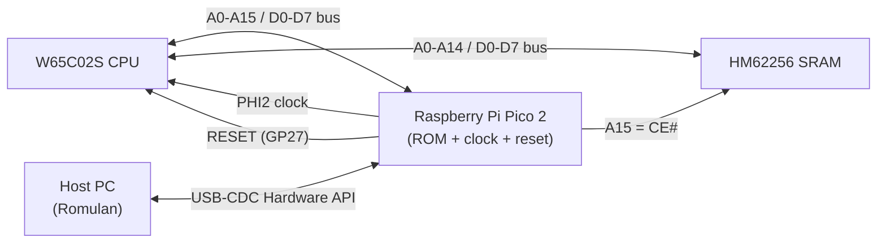

# Piclone

> A Raspberry Pi Pico acts as the **ROM and clock** for a real **W65C02S** CPU on a breadboard: single 3.3 V logic, no EPROM, no oscillator can, no level shifters.

[](https://big-iron-cde.github.io/piclone/)
[](https://big-iron-cde.github.io/piclone/)
[](https://github.com/big-iron-cde/piclone/blob/main/LICENSE)

The Pico holds a 32 KB ROM image in SRAM and serves it to the CPU's address bus in real time, generates the PHI2 clock, and drives RESET. A host PC builds ROM images and talks to the Pico over a framed USB-serial **Hardware API** to upload ROMs and capture bus cycles for automated testing.

**Full documentation (wiring reference, firmware internals, API):** [piclone.big-iron.dev](https://piclone.big-iron.dev)

## Table of Contents

- [Piclone](#piclone)
  - [Table of Contents](#table-of-contents)
  - [Features](#features)
  - [Architecture](#architecture)
  - [Hardware](#hardware)
  - [Wiring](#wiring)
    - [Board layout](#board-layout)
    - [Diagram 1: 65C02 ↔ Pico](#diagram-1-65c02--pico)
    - [Diagram 2: 65C02 ↔ RAM](#diagram-2-65c02--ram)
    - [Shared bus (65C02 ↔ Pico ↔ RAM)](#shared-bus-65c02--pico--ram)
    - [Point-to-point connections](#point-to-point-connections)
    - [Pull-up resistors (6 × 10 kΩ, all to +3.3 V)](#pull-up-resistors-6--10-kω-all-to-33-v)
    - [Power](#power)
  - [Prerequisites](#prerequisites)
  - [Installation](#installation)
    - [Pico Board Types](#pico-board-types)
  - [Usage](#usage)
  - [Hardware API](#hardware-api)
  - [Examples](#examples)
  - [Testing](#testing)
  - [Deployment](#deployment)
  - [Project Structure](#project-structure)
  - [Documentation Website](#documentation-website)
  - [Roadmap](#roadmap)
  - [Contributing](#contributing)
  - [License](#license)
  - [Authors \& Acknowledgements](#authors--acknowledgements)
  - [References](#references)

## Features

- Runs a real W65C02S from a Pico-hosted 32 KB ROM image mapped to `$8000–$FFFF`.
- Generates the PHI2 clock (default **1 kHz**, ~1 ms/cycle; optional `phi2_hz` on `read`).
- Drives RESET (open-drain emulated) and auto-starts clock + ROM + reset on USB connect.
- Single 3.3 V logic level: no MOSFETs, level shifters, or oscillator chip.
- Framed USB-serial **Hardware API** (JSON) for scripted bring-up and CI.
- Structured JSON bus-cycle capture (`read` until `STP`) for automated tests.
- Optional ASCII bus monitor for manual breadboard observation.
- Host-side ROM builder with 6502-address helpers and a `STP` terminator.

## Architecture

The CPU sees a single 64 KB address space split by **A15**, which doubles as the chip-select with no external address decoder:



Memory map:

```
$0000 ─┬─────────────────┐
       │   RAM (HM62256) │   A15 = 0  → RAM selected
$7FFF ─┤                 │
$8000 ─┼─────────────────┤
       │   ROM (Pico)    │   A15 = 1  → Pico drives the bus
$FFFF ─┴─────────────────┘
```

When `A15 = 0` the RAM is selected and the Pico stays Hi-Z; when `A15 = 1` the Pico serves `rom_image[addr & 0x7FFF]`. The same wire deselects the RAM, so no inverter or decoder is needed.

## Hardware

| Part | Qty | Notes |
|---|---|---|
| Raspberry Pi Pico 2 | 1 | Acts as ROM + clock source |
| W65C02S | 1 | The CPU |
| HM62256LP | 1 | RAM. **5 V part run at 3.3 V, out of spec, may be flaky** |
| 10 kΩ resistor | 6 | Pull-ups for 65C02 control inputs |
| External 3.3 V supply | 1 | Powers 65C02 + RAM + pull-ups |
| Breadboard + jumper wires | 1 | Full-size (~830 tie-points) recommended |

**Not needed:** MOSFETs, oscillator can, bypass caps, level shifters.

## Wiring

This is the minimum wiring to reproduce the build. For the full per-chip pin-by-pin maps (40-pin W65C02S, 28-pin HM62256) and the complete Pico GPIO allocation, see the [hardware reference](https://big-iron-cde.github.io/piclone/hardware/pinout.html).

### Board layout

Component placement on the breadboard, left to right: the **3.3 V supply** (top-left), the **HM62256 RAM**, the **W65C02S CPU**, and the **Raspberry Pi Pico 2**. Knowing this order makes the two wiring diagrams below easier to follow.


The full wiring is split into two diagrams because routing every net in a single view was unreadable. Both halves share the same 65C02 in the middle; together they form the complete circuit. In both, **red = +3.3 V rail** and **blue = GND rail**.

### Diagram 1: 65C02 ↔ Pico

The Pico drives the address bus and the ROM data bus, plus RESET and PHI2 (the green wires). Purple wires are the shared A0–A15 / D0–D7 bus; the resistors are the 10 kΩ pull-ups on the 65C02 control inputs.


### Diagram 2: 65C02 ↔ RAM

The same address and data bus continues from the 65C02 to the HM62256 RAM (orange wires), with `RWB → WE#` for writes and `A15 → CE#` for chip-select. The 3.3 V supply module sits on the right.


### Shared bus (65C02 ↔ Pico ↔ RAM)

| Net | 65C02 pin | Pico pin (GP) | RAM pin |
|---|---|---|---|
| A0 | 9 | 1 (GP0) | 10 |
| A1 | 10 | 2 (GP1) | 9 |
| A2 | 11 | 4 (GP2) | 8 |
| A3 | 12 | 5 (GP3) | 7 |
| A4 | 13 | 6 (GP4) | 6 |
| A5 | 14 | 7 (GP5) | 5 |
| A6 | 15 | 9 (GP6) | 4 |
| A7 | 16 | 10 (GP7) | 3 |
| A8 | 17 | 11 (GP8) | 25 |
| A9 | 18 | 12 (GP9) | 24 |
| A10 | 19 | 14 (GP10) | 21 |
| A11 | 20 | 15 (GP11) | 23 |
| A12 | 22 | 16 (GP12) | 2 |
| A13 | 23 | 17 (GP13) | 26 |
| A14 | 24 | 19 (GP14) | 1 |
| A15 / RAM CE# | 25 | 31 (GP26) | 20 |
| D0 | 33 | 20 (GP15) | 11 |
| D1 | 32 | 21 (GP16) | 12 |
| D2 | 31 | 22 (GP17) | 13 |
| D3 | 30 | 24 (GP18) | 15 |
| D4 | 29 | 25 (GP19) | 16 |
| D5 | 28 | 26 (GP20) | 17 |
| D6 | 27 | 27 (GP21) | 18 |
| D7 | 26 | 29 (GP22) | 19 |

### Point-to-point connections

| From | To | Purpose |
|---|---|---|
| 65C02 pin 34 (RWB) | RAM pin 27 (WE#) | CPU write-enable to RAM |
| Pico pin 32 (GP27) | 65C02 pin 40 (RESB) | Reset control |
| Pico pin 34 (GP28) | 65C02 pin 37 (PHI2) | Clock at 0.2 Hz |
| Pico GP23 | 65C02 pin 34 (RWB) | Read/write sense for bus monitor |
| RAM pin 22 (OE#) | +3.3 V | Outputs disabled (writes only), avoids bus contention |

### Pull-up resistors (6 × 10 kΩ, all to +3.3 V)

| Resistor | Pulls up | Why |
|---|---|---|
| R1 | 65C02 pin 2 (RDY) | CPU stalls if RDY floats low |
| R2 | 65C02 pin 4 (IRQB) | Inactive (high) when unused |
| R3 | 65C02 pin 6 (NMIB) | Inactive (high) when unused |
| R4 | 65C02 pin 36 (BE) | Bus always enabled |
| R5 | 65C02 pin 40 (RESB) | High when Pico isn't asserting reset |
| R6 | 65C02 pin 38 (SOB) | Inactive (high) when unused |

### Power

- **Pico:** powered from **USB only** while developing.
- **Breadboard rail:** external **3.3 V** → 65C02 VDD (pin 8), RAM VCC (pin 28), RAM OE# (pin 22), and all 6 pull-ups.
- **Common ground:** tie Pico GND, 65C02 VSS (pin 21), RAM VSS (pin 14), and the external supply GND together.

> [!WARNING]
> Do **not** connect external 3.3 V to Pico **VSYS (pin 39)** or **3V3 OUT (pin 36)** while USB is plugged in. USB back-feeds ~4.5 V on VSYS and fights the breadboard rail, freezing the CPU with a stuck address bus.

## Prerequisites

- [Raspberry Pi Pico SDK](https://github.com/raspberrypi/pico-sdk) + ARM GCC toolchain (set `PICO_SDK_PATH`)
- [CMake](https://cmake.org/) ≥ 3.13 and `make`, firmware targets the **Pico 2** (`PICO_BOARD=pico2`)
- [picotool](https://github.com/raspberrypi/picotool) (optional, for flashing without BOOTSEL)
- Python 3.8+ and [uv](https://github.com/astral-sh/uv) for the [Romulan](https://github.com/big-iron-cde/romulan) host client

## Installation

Build the Pico firmware (requires `PICO_SDK_PATH` and `arm-none-eabi-gcc`):

```bash
export PICO_SDK_PATH=~/vsarm/pico-sdk   # your SDK checkout path
cd src
mkdir -p build && cd build
cmake .. -DPICO_BOARD={BOARD_TYPE}
make
```

The project bundles `pico_sdk_import.cmake`, so no separate SDK-import step is needed. Output: `build/piclone.uf2`.

Set up the [Romulan](https://github.com/big-iron-cde/romulan) host client (a sibling checkout of this repo):

```bash
cd ~/Downloads/romulan
uv sync
```

### Pico Board Types

This software supports the Raspberry Pi Pico SoC. Pass the following valid values to the `-DPICO_BOARD` argument in the `cmake` command
depending on the board intended for use:

* `pico`
* `pico_w`
* `pico2`
* `pico2_w`

## Usage

1. **Flash the firmware:** see [Deployment](#deployment). On USB connect the Pico auto-starts the clock, ROM emulation, and releases RESET; the built-in demo runs immediately.
2. **Build a ROM image and upload it** with Romulan:

```bash
cd ~/Downloads/romulan
uv run romulan program.txt --build --upload                 # assemble + upload via Hardware API
uv run romulan hardware upload bin/rom.bin --port /dev/ttyACM0
uv run romulan hardware capture --max-cycles 500 --port /dev/ttyACM0
```

> [!NOTE]
> `rom_image[]` lives in SRAM and is lost on Pico power-cycle, re-upload after each reboot.

## Hardware API

The host talks to the Pico over USB-CDC at **115200 baud** using a framed protocol. Each transaction is `ENQ → STX → ACK → payload → EOT → ACK/NACK`; **all payloads are JSON with `"v":1`** (including the chunked, base64-encoded ROM upload). An optional `"id"` is echoed in responses.

| Command | Request | Response |
|---|---|---|
| `reset` | `{"v":1,"cmd":"reset","assert":true}` | `{"v":1,"ok":true,"asserted":true}` |
| `upload_rom` | `begin` → `chunk` (base64) × N → `commit` | per-phase acks; `commit` returns `reset_vector` |
| `read` | `{"v":1,"cmd":"read","until":"stp","max_cycles":10000}` | event stream then `{"type":"event","event":"done",...}` |
| `request_addr` | `{"v":1,"cmd":"request_addr"}` | `{"v":1,"ok":true,"addr":"4000","phi2_hz":0.2}` |
| `monitor` | `{"v":1,"cmd":"monitor","enable":true}` | toggles ASCII bus table (off by default) |
| `status` | `{"v":1,"cmd":"status"}` | full hardware snapshot (clock, reset, ROM, monitor) |

> [!IMPORTANT]
> Don't open a plain serial monitor on the port while using the Hardware API, and disable `monitor` before scripted upload/read; unstructured output corrupts framing. Use `--read-stp`, which disables it automatically.

Full protocol and command reference: [Hardware API docs](https://big-iron-cde.github.io/piclone/hardware-api.html).

## Examples

Drive the device from Python using Romulan's client:

```python
from romulan.hardware_api import HardwareAPI

with HardwareAPI("/dev/ttyACM0") as api:
    print(api.status())

    api.reset(assert_reset=True)                       # hold CPU in reset
    api.upload_rom(open("bin/rom.bin", "rb").read())   # chunked, base64-encoded upload
    api.reset(assert_reset=False)                      # release → run

    capture = api.read_until_stp(max_cycles=500)       # disables monitor; ~12 s/frame
    print(capture.reason, len(capture.cycles))
```

A captured bus cycle looks like:

```json
{"v":1,"type":"event","event":"cycle","seq":1,"addr":"8000","data":"18","rw":0}
```

## Testing

Automated tests use the JSON bus-cycle stream. End the ROM with a `STP` (`0xDB`) instruction so capture stops deterministically:

```bash
cd ~/Downloads/romulan
uv run romulan program.txt --build --upload             # demo program ends in STP
uv run romulan hardware capture --until stp --port /dev/ttyACM0
```

`read_until_stp()` captures one frame per PHI2 rising edge until the CPU fetches `STP` or `max_cycles` is reached. At the default 0.2 Hz clock, frames arrive ~every 5 s (host waits up to 12 s/frame).

## Deployment

Flash `src/build/piclone.uf2` to the Pico:

- **BOOTSEL:** hold BOOTSEL, plug in USB, drag the `.uf2` onto the mass-storage drive.
- **picotool** (device already running firmware):

```bash
cd src/build
picotool load -f piclone.uf2
```

## Project Structure

```
piclone/
├── src/                  # Pico firmware (C, pico-sdk)
│   ├── main.c            # pin setup, PHI2 clock, ROM emulation loop
│   ├── hardware_api.c/.h # v1 JSON command handling over framed serial
│   ├── protocol.c/.h     # ENQ/STX/ACK/EOT/NACK framing
│   ├── json_util.c/.h    # JSON payload helpers (cJSON wrapper)
│   ├── pico_sdk_import.cmake
│   └── third_party/cJSON # bundled JSON parser
├── docs/                 # Documentation website (Sphinx + Doxygen)
└── README.md
```

> [!NOTE]
> ROM building and host-side control live in the separate [Romulan](https://github.com/big-iron-cde/romulan) repository, see [Host tools](https://big-iron-cde.github.io/piclone/host-tools.html).

## Documentation Website

The complete documentation (full wiring reference, firmware internals, the Hardware API protocol, and host-tool API) is published at **<https://big-iron-cde.github.io/piclone/>**.

Build it locally:

```bash
pip install -r docs/requirements.txt
doxygen docs/Doxyfile
sphinx-build docs docs/_build/html
```

## Roadmap

- [ ] Fail-safe data-bus behavior when the Pico is unpowered (currently back-powered through GPIO protection diodes).
- [ ] Hot-swap ROM updates via CPU tri-state (BE is permanently held high today).
- [ ] Add decoupling caps for noise immunity.
- [ ] Replace HM62256 with an in-spec 3.3 V SRAM for reliable RAM reads.
- [ ] PIO + DMA ROM emulation to replace GPIO polling for higher clock speeds.

## Contributing

Contributions are welcome. Please open an issue to discuss substantial changes first, then submit a pull request against `main`. Keep firmware changes in sync with the pin map and the Hardware API documentation.

## License

Released under the [MIT License](https://github.com/big-iron-cde/piclone/blob/main/LICENSE).

## Authors & Acknowledgements

- [big-iron-cde](https://github.com/big-iron-cde)
- Built on the [Raspberry Pi Pico SDK](https://github.com/raspberrypi/pico-sdk).

## References

- [W65C02S datasheet (WDC)](https://www.westerndesigncenter.com/wdc/documentation/w65c02s.pdf)
- [HM62256 SRAM datasheet](https://datasheetspdf.com/datasheet/HM62256.html)
- [Raspberry Pi Pico 2 datasheet](https://datasheets.raspberrypi.com/pico/pico-2-datasheet.pdf)
- [Raspberry Pi Pico SDK documentation](https://www.raspberrypi.com/documentation/pico-sdk/)
- [6502 opcode reference](https://www.masswerk.at/6502/6502_instruction_set.html)
