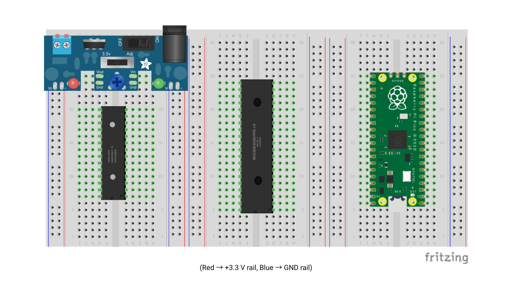
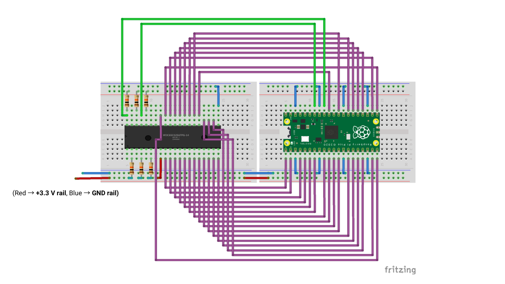
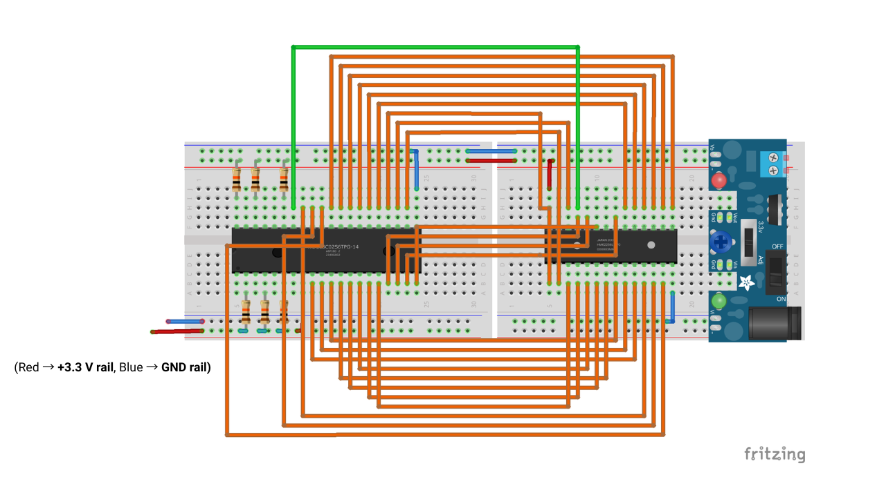

# Wiring — Complete Connection List

One place to look while wiring. For the per-chip pin diagrams, see
[Pinout Reference](pinout.md).

## Circuit diagrams

Component placement on the breadboard, left to right: the **3.3 V supply**, the
**HM62256 RAM**, the **W65C02S CPU**, and the **Raspberry Pi Pico 2**. Knowing this order
makes the two wiring diagrams below easier to follow.

The full wiring is split into two diagrams because routing every net in a single view was
unreadable. Both halves share the same 65C02 in the middle; together they form the complete
circuit. In both, **red = +3.3 V rail** and **blue = GND rail**.

### Diagram 1 — 65C02 ↔ Pico

The Pico drives the address bus and the ROM data bus, plus RESET and PHI2 (the green wires).
Purple wires are the shared A0–A15 / D0–D7 bus; the resistors are the 10 kΩ pull-ups on the
65C02 control inputs.

### Diagram 2 — 65C02 ↔ RAM

The same address and data bus continues from the 65C02 to the HM62256 RAM (orange wires),
with `RWB → WE#` for writes and `A15 → CE#` for chip-select. The 3.3 V supply module sits on
the right.

The connection tables below list every net precisely.

## Bus connections (shared by 65C02, Pico, RAM)

| Net | 65C02 pin | Pico pin (GP) | RAM pin |
|---|---|---|---|
| A0 | 9 | 1 (GP0) | 10 |
| A1 | 10 | 2 (GP1) | 9 |
| A2 | 11 | 4 (GP2) | 8 |
| A3 | 12 | 5 (GP3) | 7 |
| A4 | 13 | 6 (GP4) | 6 |
| A5 | 14 | 7 (GP5) | 5 |
| A6 | 15 | 9 (GP6) | 4 |
| A7 | 16 | 10 (GP7) | 3 |
| A8 | 17 | 11 (GP8) | 25 |
| A9 | 18 | 12 (GP9) | 24 |
| A10 | 19 | 14 (GP10) | 21 |
| A11 | 20 | 15 (GP11) | 23 |
| A12 | 22 | 16 (GP12) | 2 |
| A13 | 23 | 17 (GP13) | 26 |
| A14 | 24 | 19 (GP14) | 1 |
| A15 / RAM CS# | 25 | 31 (GP26) | 20 |
| D0 | 33 | 20 (GP15) | 11 |
| D1 | 32 | 21 (GP16) | 12 |
| D2 | 31 | 22 (GP17) | 13 |
| D3 | 30 | 24 (GP18) | 15 |
| D4 | 29 | 25 (GP19) | 16 |
| D5 | 28 | 26 (GP20) | 17 |
| D6 | 27 | 27 (GP21) | 18 |
| D7 | 26 | 29 (GP22) | 19 |

## Point-to-point connections

| From | To | Purpose |
|---|---|---|
| 65C02 pin 34 (RWB) | RAM pin 27 (WE#) | Write enable to RAM |
| Pico pin 32 (GP27) | 65C02 pin 40 (RESB) | Reset control |
| Pico pin 34 (GP28) | 65C02 pin 37 (PHI2) | Fixed clock at 0.2 Hz (5 s per cycle) |
| Pico GP23 | 65C02 pin 34 (RWB) | Read/write sense for the bus monitor |
| RAM pin 22 (OE#) | +3.3 V | Outputs disabled — writes only, avoids contention |

## Pull-up resistors (6 × 10 kΩ, all top to +3.3 V)

| Resistor | Pulls up | Why |
|---|---|---|
| R1 | 65C02 pin 2 (RDY) | CPU stalls if RDY floats low |
| R2 | 65C02 pin 4 (IRQB) | Inactive (high) when unused |
| R3 | 65C02 pin 6 (NMIB) | Inactive (high) when unused |
| R4 | 65C02 pin 36 (BE) | Bus always enabled |
| R5 | 65C02 pin 40 (RESB) | High when Pico isn't asserting reset |
| R6 | 65C02 pin 38 (SOB) | Inactive (high) when unused — cheap insurance |

## Leave open

| 65C02 pins | Pico pins |
|---|---|
| 1 (VPB), 3 (PHI1O), 5 (MLB), 7 (SYNC), 35 (NC), 39 (PHI2O) | 30 (RUN), 35 (ADC_VREF), 36 (3V3 OUT), 37 (3V3_EN), 40 (VBUS) |
